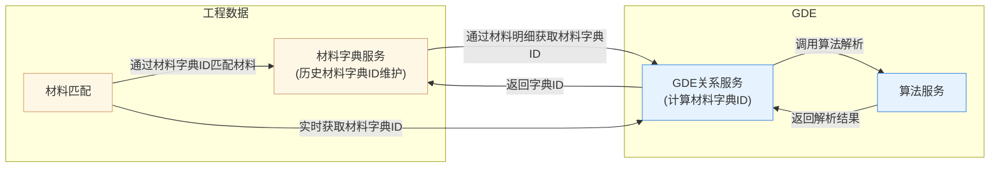

### 1.背景
>以工程数据应用场景为切入点，打造L3整体服务能力平台
#### 1.1工程数据场景
1. 工程数据-广材网材料匹配场景(*GDE能力支持*)

>1.材料字典服务：通过GDE服务接口进行材料字典解析，维护工程数据字典库(用于业务查询)
>2.材料匹配：代表业务操作，在产品使用时通过实时获取材料字典ID的方式并查询字典库
>3.GDE侧会有自己的缓存(Redis)，当缓存失效时走算法解析服务
2. 工程数据--计价文件湖仓方案替换
