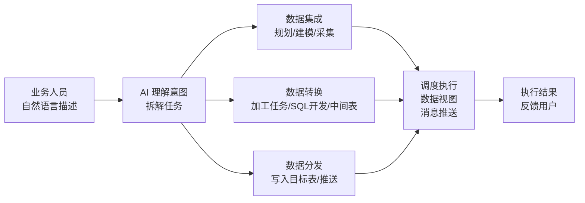
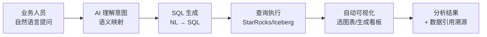
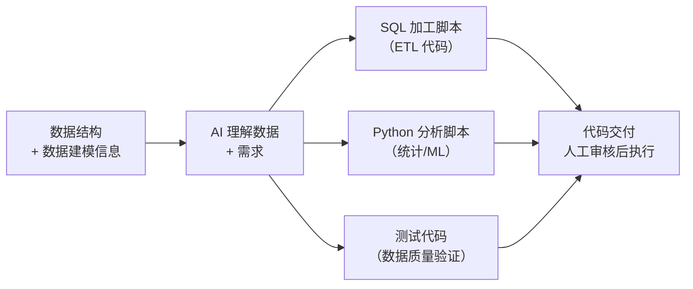
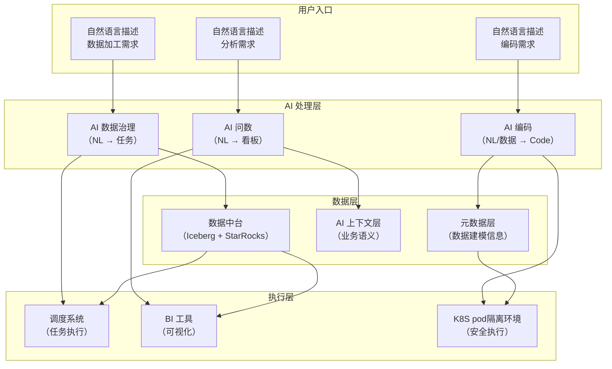

# 总结

## 一、集成能力扩展

数据中台的集成能力需要从**结构化数据**扩展到**非结构化数据**：

| 维度 | 当前能力 | 需扩展能力 |
|------|---------|-----------|
| **结构化数据** | Debezium CDC、FlinkX 批量同步、API 对接 | 保持 |
| **非结构化数据** | ❌ 缺失 | 文档解析、图片 OCR、音视频转写、日志结构化 |
| **半结构化数据** | 部分支持 | JSON/XML 深度解析、嵌套结构扁平化 |
| **向量数据** | ❌ 缺失 | Embedding 生成、向量索引、相似度检索 |
**数据向量化调研：**
  - 当前数据工具链在数据向量化和相似度检索上有能力缺口。结合工程数据等场景，基于lancedb的技术方案，寻找与产线需求的结合点。
## 二、湖仓架构选择

**Apache Iceberg** 已成为行业共识，与 Databricks、Snowflake 的方向一致：

| 能力             | Iceberg 支持                  | Databricks         | Snowflake                 |
| -------------- | --------------------------- | ------------------ | ------------------------- |
| **多引擎访问**      | Spark/Flink/Trino/StarRocks | UniForm 桥接 Iceberg | Polaris 贡献 Apache         |
| **Schema 演进**  | 全操作支持                       | 支持                 | 支持                        |
| **Catalog 服务** | Polaris（REST API）           | Unity Catalog      | Polaris + Horizon Catalog |
| **时间旅行**       | 原生支持                        | 支持                 | 支持                        |

## 三、AI 三大方向

### 方向一：AI 数据治理（NL → 数据加工任务/数据中台的系统操作-- **孟京伟简单提过**）

**定义**：通过自然语言描述数据加工需求，AI 自动生成加工逻辑并执行。

**本质**：AI 到数据加工任务的链路。

**对标 Databricks/Snowflake**：

| 能力 | Databricks | Snowflake | 我们的路径 |
|------|------------|-----------|-----------|
| **AI 生成 ETL** | Agent Bricks（Agent 自动编排） | Cortex Agents（工具调用） | 自研 SQL 加工模型 + LLM |
| **自然语言定义加工规则** | Agent Framework（Python API） | Cortex Agents（SQL/Python 工具） | 自然语言 → 自研 SQL 模型 |
| **自动任务调度** | Workflow + Agent 自动触发 | Tasks + Cortex Agents | 现有调度系统 + Agent 编排 |
| **质量校验** | Auto Loader + 推荐质量检查 | Cortex Analyst 语义验证 | 数据质量规则 + AI 质量监控 |

**典型场景**：
- "每天凌晨把订单表按区域汇总，写入日报表"
- "监控订单金额，如果单日波动超过 30% 就发告警"
- "把最近 7 天的用户行为数据备份到冷存储"

---

### 方向二：AI 问数（NL → 数据分析结果）

**定义**：通过自然语言描述分析需求，AI 自动生成 SQL 并返回可视化看板。

**本质**：AI 到数据分析结果的链路。

**对标 Databricks/Snowflake**：

| 能力 | Databricks | Snowflake | 我们的路径 |
|------|------------|-----------|-----------|
| **NL→SQL** | Genie（自然语言查询） | Cortex Analyst（语义模型） | 业务模型 + LLM |
| **多轮对话** | Genie + AI/BI Dashboard | Cortex Agents（多步推理） | LLM 多轮上下文管理 |
| **自动可视化** | AI/BI Dashboard（自动图表） | Cortex Analyst（自动选图表） | Datart(永洪?) + AI |
| **引用溯源** | AI Search（数据溯源） | Cortex Analyst（引用来源） | 元数据 + 数据血缘 |
| **语义层** | Unity AI Gateway（统一语义） | Cortex Analyst（语义模型） | AI 上下文层 |

**典型场景**：
- "上个月各区域的 GMV 是多少？"
- "对比一下华东和华南的用户增长趋势"
- "哪些产品的库存周转天数超过 30 天？"

---

### 方向三：AI 编码（数据 + 数据建模信息 → Code）

**定义**：基于数据结构和数据建模信息，AI 自动生成数据处理代码、分析脚本、建模代码。

**本质**：AI 到 Code 的链路。

**对标 Databricks/Snowflake**：

| 能力               | Databricks                      | Snowflake                   | 我们的路径                      |
| ---------------- | ------------------------------- | --------------------------- | -------------------------- |
| **AI 生成 SQL**    | Agent Bricks（NL→SQL 代码）         | Cortex Analyst（NL→SQL）      | 自研 SQL 模型 + LLM            |
| **AI 生成 Python** | Databricks Notebook + AI Assist | Snowpark Container Services | LLM + AI Generate Pipeline |
| **AI 生成 ETL 脚本** | Agent Framework（自动编排）           | Cortex Agents（工具调用）         | LLM + AI Generate Pipeline |
| **AI 辅助建模**      | Mosaic AI（自动特征工程）               | Cortex ML Functions         | -                          |
| **代码审核**         | Unity Catalog（权限控制）             | Horizon Catalog（治理）         | 代码 Review + 自动化测试          |

**典型场景**：
- "帮我写一个 Spark 脚本，把用户行为日志按天汇总成用户画像表"
- "基于这个数据集，帮我写一个预测用户流失的模型代码"
- "帮我生成这个 ETL 任务的数据质量校验代码"

**Pipeline/SQL with llm function 调研**：
1.SQL with llm function：结合数据库能力，在入库时提供AI能力完成数据向量化存储，并提供ai function进行llm能力接入
2.Pipeline with llm function：在数据加工pipeline中，整合AI能力，在数据人中以算子形式与AI整合。
  - [ ] 需识别的点：
    - [ ] 在广联达内容是否存在真实场景，且具备较高的落地价值，需要结合产线需求进行评估
    - [ ] 与现有工作流模式的区别是什么，相比于现有模式剧本何等优势和收益
---

## 四、三大方向的关系

| 方向 | 输入 | 输出 | 核心技术 | 对标 |
|------|------|------|---------|------|
| **AI 数据治理** | 自然语言 + 数据 | 加工任务 + 执行结果 | Agent 编排 + 自研 SQL | Databricks Agent Bricks / Snowflake Cortex Agents |
| **AI 问数** | 自然语言 + 语义模型 | 分析看板 + 数据引用 | NL→SQL + 自动可视化 | Databricks Genie / Snowflake Cortex Analyst |
| **AI 编码** | 数据结构 + 建模信息 | 代码（SQL/Python/ETL） | LLM + 代码生成 + 安全执行 | Databricks AI Assist / Snowflake Snowpark |

### 五、其他方向
1.非机构化数据:当下识别需求不明确，且价值不凸显，定义低一级优先级。
2.model serving & training：与AI工程院比较贴合，结合点在于可能存在的场景，“在AI训练过程中需要数据工具链数据做训练集，测试集，验证集”等。model serving&training本身定义为AI平台的范围，定义为最低优先级。