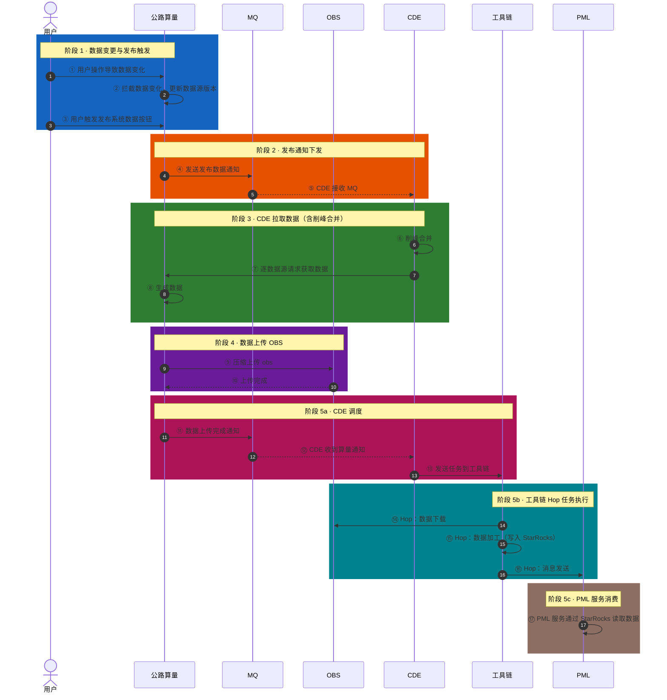
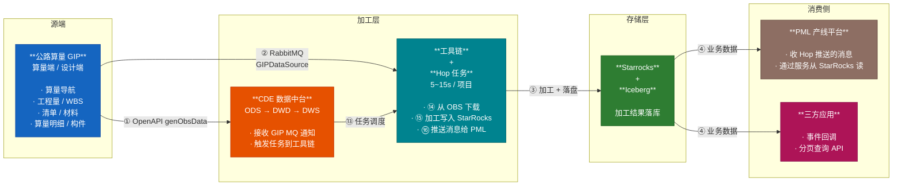
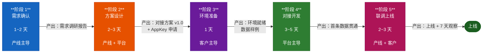

### 0.1 一句话先讲明白
> 公路算量是数据源头，数据提交后通过消息通知CDE，CDE 收到 MQ 后**把任务发到工具链**，工具链启动 **Hop 任务**完成"下载→加工→推送"三步，加工结果写入 **数据湖**，**PML** 收到消息后**通过服务读 StarRocks** 消费。**特别注意**：CDE 本身不读 OBS、不写 StarRocks——**这些都在工具链的 Hop 任务里**。
### 0.2 全流程总览（时序图）
![[Ps.png]]

### 0.3 五个阶段拆解

| 段 | 名称 | 触发方 | 关键产物 | 失败兜底 |
|---|------|------|---------|---------|
| 1 | 数据变更与发布触发 | 用户 | GIP 数据源版本号 | GIP 重试拦截逻辑 |
| 2 | 发布通知下发 | 公路算量 | MQ 消息（"发布数据通知"） | MQ 重投，CDE 幂等消费 |
| 3 | CDE 拉取数据 | CDE | 拉取请求被 GIP 处理 | 削峰合并 + 请求重试 |
| 4 | 数据上传 OBS | 公路算量 | OBS Parquet 文件 | OBS 路径幂等 + 断点续传 |
| 5a | CDE 调度到工具链 | CDE | 工具链任务 | 任务重发 + 幂等 |
| 5b | 工具链 Hop 任务执行 | 工具链 | StarRocks 落盘 + 业务消息 | Hop 重跑 + 消息重投 |
| 5c | PML 服务消费 | PML | 业务数据查询 | StarRocks 重读 |

### 0.3.1 首次接入：3 个 OpenAPI（一次性）

> 上面 0.2 时序图聚焦"运行时单次数据流转"（一个发布按钮按下后发生了什么）。**首次接入一个新的项目**时，还需要以下 3 个 OpenAPI 配合（来自文档 2.2 节），跑完一遍后才进入 0.2 的运行时循环：

| 步骤 | OpenAPI | 用途 |
|------|---------|------|
| a | `GET /openApi/project/v1/getProjectList` | 一次性拉取 GIP 中所有项目清单 |
| b | `POST /openApi/dataSource/v1/getDataVersion` | 拿到每个项目各 dataSourceType 的当前版本号 |
| c | `GET /openApi/dataSource/v1/genObsData?dataSourceType=xx` | 触发首次数据生成（**每个 dataSourceType 调一次**） |

### 0.4 关键名词（产线话术对照）

| 名词 | 技术含义 | 描述                               |
|------|----------|----------------------------------|
| GIP | 公路算量系统代号 | "算量端"                            |
| dataSourceType | 数据源类型（quantity / wbs / bid / materialQuantity / ownerBill ...） | "一次只拉一种数据，用于标识数据类型"              |
| taskId | 一次数据生成任务 ID | "这次任务号"                          |
| dataSourceVersion | 数据版本号（每次生成自增） | "数据版本，保证数据不后退，后退数据可丢弃"           |
| objectKey | OBS 文件路径 | "文件在对象存储里的地址"                    |
| sessionId | 一次发布的会话 ID | "这次发布的批次号"                       |
| recordStatus | 软删除标识（0=可用，1=删除） | "删了但留痕，对账要用"                     |
| md5 | 行级指纹 | "变了就拉，没变就跳"                      |
| parquet | 列式压缩文件格式 | "体积小、查询快的数据文件"                   |
| tenantId / projectId | 租户 / 项目 ID | "数据隔离的两把钥匙"                      |
| 削峰合并 | CDE 内部对高频变更的批处理 | "CDE 不会一有变更就拉，会攒一波再拉，后退的版本也在这里过滤掉" |
| 工具链 | 调度 Hop 任务执行的引擎 | "CDE 收到 MQ 后不是自己干，是工具链去跑 Hop"    |
| Hop 任务 | 工具链执行的 ETL 任务，三步走：下载→加工→推送 | "一个任务干三件事：拉数据、加工、推消息"            |
| PML | 产线业务平台，最终消费方 |                                  |
| StarRocks | Hop 任务加工结果的落库；PML 通过服务从这里读 | "下游查数据都从这读"                      |

### 0.5 四个细节点

1. **数据变化 ≠ 自动发布**。GIP 会拦截数据变化并更新版本号（步骤 ②），但**发布必须用户主动点按钮**（步骤 ③）。所以并不是"我改完数据 CDE 就该有"，那是误解，**0.2 整个流程跑不起来**。
2. **CDE 收到 MQ 后不直接下载，把任务发到工具链**。工具链启动 **Hop 任务**三步走：⑭ 下载（从 OBS）→ ⑮ 加工（写入 StarRocks）→ ⑯ 推送消息（给 PML）。**CDE 本身不读 OBS、不写 StarRocks**，这些都在工具链的 Hop 任务里。
3. **CDE 的削峰合并是保命设计**（步骤 ⑥）。客户如果高频变更（比如一天改 1000 次），CDE 会合并请求再拉，**别承诺客户"每次变更 5 秒内下游可见"**——实际是"批量变更后 5 秒内可见"。
4. **CDE和工具链的关系**,CDE处理**业务数据**，工具链提供**运行时任务环境+任务管理**,共同完成交付

### 0.6 流程中能得到什么

- **"你们怎么拿到算量数据的"**：参考 17 步时序图（用户操作→GIP→MQ→CDE→工具链→Hop→StarRocks→PML 服务）。
- **"数据延迟多大"**：看阶段 3→4→5 的耗时（5W 量级 15~50s）.
- **"数据丢了怎么办"**：看阶段 5 的兜底（MQ 重投 + CDE 主动重试）

下面会按下面顺序展开：业务理解 → 技术对接 → 协作流程 → 客户答疑 → 案例经验。

## 1. 全景图：

### 1.1 整体链路图




### 1.2 三条通道的定位（产线要记牢的一张表）

| 通道 | 适用对象 | 数据粒度 | 实时性 | 典型场景 |
|------|---------|---------|--------|---------|
| **OpenAPI（拉）** | 平台内部 / 集成方 | 项目级 | 即时 | 首次全量接入、获取项目列表、触发数据生成 |
| **MQ 消息（推）** | 内部产线 | 表级 | 秒级 | WBS 变更、清单变更，驱动下游工作流 |
| **事件回调（推）** | 三方应用 | 业务级 | 秒级 | 通过事件中心订阅，平台主动推送 |
| **分页查询 API（拉）** | 所有消费方 | 业务单据级 | 分钟级 | 增量同步、报表查询、对账 |

> **关键认知**：CDE 本身不"保存"算量的真相，算量的真相在 GIP。CDE 做的是"**沉淀 + 加工 + 再分发**"。上游的源数据是 GIP，CDE 的 ODS 是一份镜像，DWS 是再加工后的台账。

---

## 2. 业务理解维度：业务对象怎么映射成数据字段？

### 2.1 公路算量的数据映射关系

下表是平台已经标准化好的映射关系：

| 业务对象 | 通俗解释 | ODS 表 | CDE 对外服务表 | 单项目典型量级 |
|---------|---------|--------|--------------|--------------|
| **算量导航** | 量从哪来、按什么层级组织 | `t_ods_quantity_nav` | `dwd_t_cqn_position` | 5W |
| **工程量** | 具体的"一块混凝土多少方" | `t_ods_quantity` | `dws_t_engineering_quantity` | 20W |
| **WBS（部位）** | 工程量挂在哪个部位上 | `t_ods_wbs` | `t_wbs` (分页查询) | 5W |
| **业主清单** | 业主视角的清单子目 | `t_ods_bid` / `t_ods_owner_bill` | `gip_owner_bill` | 1W |
| **清单↔工程量关联** | 清单子目由哪些工程量组成 | `t_ods_bid_quantity_relation` | — | 20W |
| **WBS↔工程量关联** | 工程量挂在哪个 WBS 上 | `t_ods_wbs_quantity_relation` | — | 20W |
| **材料量** | 工程量用了多少料 | `t_ods_material_quantity` | `dws_t_material_ledger_detail` | 10W |
| **对账数据** | 图纸量 vs 复核量 vs 全桥 | `t_ods_compare_quantity(_detail)` | `gip_drawing_total_quantity_reconciliation_ledger` | — |
| **算量明细 / 构件** | 算量的原始凭证文件 | `t_ods_quantity_cal_table` / `t_ods_component` | `gip_quantity_calculation_details` / `gip_component` | — |

### 2.2 最小业务单元：一条"工程量"的完整生命周期

一句话讲清楚"一条工程量在系统里长什么样"：

> **一条工程量 = 1 个工程量 ID（f_id） + 1 个算量导航（quantityNavPartId） + 0~N 个 WBS 关联 + 0~1 个清单关联 + 0~N 个材料关联**

- 它可以是"只挂在导航下"——>只进入 `dws_t_engineering_quantity`
- 它也可以是"挂在 WBS 下 + 关联清单 + 关联材料"——>同时进入物资台账、向上计量台账

> **业务语义上的"最小粒度"，不是数据库的 row，而是"一个工程量对象"**。产线在做需求沟通时，要按"对象"思考，不要按"表"思考。

### 2.3 业务字段 → 技术字段的速查

产线最常被客户问"你们这个字段是什么意思"，下面是高频字段对照：

| 业务名 | 技术字段（API 名） | 含义 | 产线口语化解释 |
|--------|------------------|------|---------------|
| 部位 | `wbsId` | 工程量在树形结构中的位置 | "K3+018~K3+057 桥面铺装 这一段" |
| 项管 WBS | `xmglWbsId` | 项管系统里的对应 WBS | "业主那边也认这个编号" |
| 图纸量 | `drawingQuantity` | CAD 图上读出来的数 | "图上写多少就是多少" |
| 复核量 | `reviewedQuantity` | 造价人员核对后的数 | "复核过的、可信的" |
| 量差 | `quantityDifference` | 复核 - 图纸 | "为什么对不上，原因在这里" |
| 损耗率 | `materialLossRate` | 材料的额外消耗比例 | "下 100 方混凝土实际要 103 方" |
| 换算系数 | `formulaValue` | 清单与工程量的单位换算 | "1 清单 = 0.5 工程量" |
| `recordStatus` | `recordStatus` | 软删除标识（0=可用，1=已删） | "删了但留痕，对账要用" |
| `md5校验码` | `md5` | 行级指纹，用于增量判重 | "变了就拉，没变就跳" |

---

## 3. 技术对接维度：技术术语、实时性、数据一致性

### 3.1 产线要懂的技术术语速查表

| 术语 | 一句话解释 | 产线怎么用 |
|------|----------|----------|
| **OBS / S3 对象存储** | 数据文件先落对象存储再发消息 | 算量数据上传不是 HTTP 推流，是 GIP 写好文件发下载链接给 CDE |
| **Iceberg 湖仓** | 表格式 + 事务 + 隐式分区 | 不像传统数据库，删数据 = `delete from where f_project_id=xxx`，对账要按时间窗口拉 |
| **Hop Pipeline / Workflow** | 数据集成 ETL 引擎 | 算量数据入湖、清洗、合并都是在 Hop 跑 |
| **StarRocks（SR）** | 实时分析型数据库 | CDE 的物化视图层，给客户报表加速用 |
| **DWS / DWD / ODS** | 分层数据架构 | ODS=原始镜像，DWD=主题整合，DWS=聚合台账 |
| **Parquet 列存** | 压缩率高的列式文件 | OBS 上的 `.parquet` 文件就是它 |
| **commit 重试 (commit.retry.num-retries)** | Iceberg 并发写冲突的容错 | 默认 50 次，**产线别动这个参数** |
| **业务事件 vs 技术事件** | 业务=客户可订阅，技术=内部流转 | `gpbp_data_linker_INFRA_WBS_DATA_CHANGED` 是业务事件，对外开放 |

### 3.2 数据变更的实时性：四种推送方式怎么选？

**关于实时性的澄清**：成本与效率的权衡

#### 3.2.1 实时性等级与适用场景

| 实时性      | 技术实现                       | 当前实测耗时                             | 适用场景              | 产线承诺话术                      |
| -------- | -------------------------- | ---------------------------------- | ----------------- | --------------------------- |
| **秒级**   | GIP 变更 → MQ → Hop 触发 → DWS | Hop 5~15s/项目（小数据），15~50s/项目（5W 量级） | 设计变更实时影响清单单价、物资调拨 | "变更发生后 1 分钟内下游可拉到新数据"       |
| **分钟级**  | 客户定时轮询分页 API               | 由客户轮询周期决定                          | 物资日报、对账报表         | "建议 5~10 分钟拉一次，差量通过 md5 过滤" |
| **天级**   | 一次性全量 + 增量修复               | 首次 10s/项目，增量 1~5s/项                | 月度结算、年度审计         | "支持 T+1 全量校核"               |
| **历史回溯** | recordUpdateTime 区间查询      | 5W 数据单次分页 < 3s                     | 任何时间窗             | "按时间段增量拉取，断点续传"             |
|          |                            |                                    |                   |                             |

#### 3.2.2 变更通知的最小闭环

变更从 GIP 触发到下游可消费，要走完以下 6 步。澄清一点："**秒级 ≠ 立即**"：

```
GIP 业务变更 → 数据校验 → 生成 Parquet → 上传 OBS → 发送 MQ (GIPDataSource)
   → CDE 监听 MQ → 触发 Hop 任务 → 写 Iceberg → 写 StarRocks → API 可查
   总耗时参考：5W 量级 15~50s（含消息处理+ Hop + 落盘）
```

### 3.3 数据不一致：常见 5 种根因 + 排查路径

产线在客户现场遇到"两边数据对不上"，**第一时间不要去查代码，按以下顺序排查**：

| 序号 | 根因 | 现象 | 排查方法 |
|------|------|------|---------|
| ① | **时间窗漏数据** | 增量拉取少了几条 | 分页时同时传 `recordUpdateTimeStart` + `recordUpdateTimeEnd`，最后对 `count` 校验，差了重拉 |
| ② | **删除被忽略** | 客户系统里有记录，CDE 没有 | 排查是否过滤了 `recordStatus=1` 的数据，**CDE 软删是 1 不是 0** |
| ③ | **md5 误判** | 数据没变但被当作变了 | 字段顺序、字段类型、空值处理不一致会算出不同 md5，**客户侧要严格按 API 文档生成** |
| ④ | **数据延迟** | 改了但下游没收到 | 查 MQ 消费日志、Hop 任务状态、StarRocks 落盘时间 |
| ⑤ | **单位/精度丢失** | 0.001 变 0.00 | DWS 字段精度是 8 位，**超过 8 位会四舍五入**，特殊场景走原始 ODS 表 |

> **黄金法则**：客户反馈数据不一致，**先问 4 个问题**——变更时间、项目 ID、recordStatus、是否做过批量删除。80% 的问题能在这 4 个问题里找到答案。

---

## 4. 协作流程与边界维度：从需求到上线的全流程

### 4.1 完整协作流程（5 阶段）



> **一个简单的判断标准**："数据流如何贯通"的问题，找平台；"客户业务怎么用"的问题，产线自己定。

---

## 5. 技术答疑维度

### 5.1 "数据安全，数据会不会泄露？"

> "**传输安全**：所有 API 走 HTTPS，MQ 走内网专线，OBS 桶有桶级 ACL。**存储安全**：数据按租户 ID 隔离，租户的数据物理上不会和别的租户混。**访问安全**：每次调用需要走平台网关，具备平台网关鉴权。"

**补充**：
- "数据能不能本地部署"——>："支持本地化"

### 5.2 "如果客户有 MDM / 数据中台，要求我们按规范转？"

**业务数仓和我们的pipeline设计就是可以兼容这种相对复杂的场景，需要有数据接入能力的支持**：

### 5.3 "数据量大了会不会很慢？"

**整体性能比较稳定，数据湖+Starrocks计算能力具备横向扩展能力**

### 5.5 "如果对接中途你们接口挂了，我们数据就全断了吗？"

**技术方案中，大量使用了OBS做原子性写入操作，比接口更稳定，另外健全监控体系可有效提升系统可用性。**

---
## 6.技术架构
![[ar.png]]
*Hop主流程

*Hop公路算量算子流*

