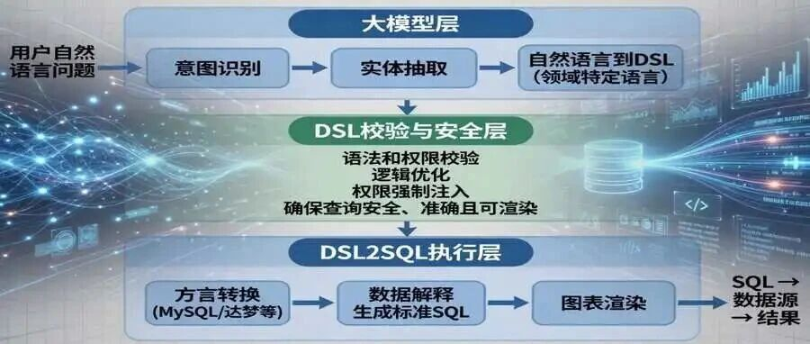
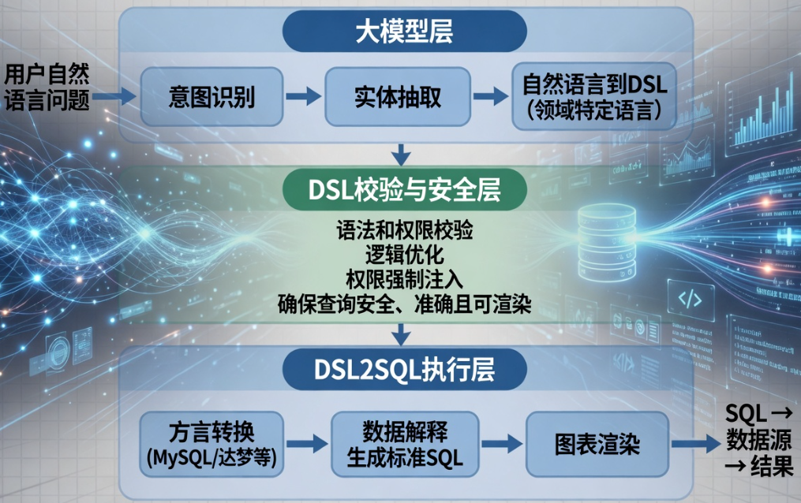
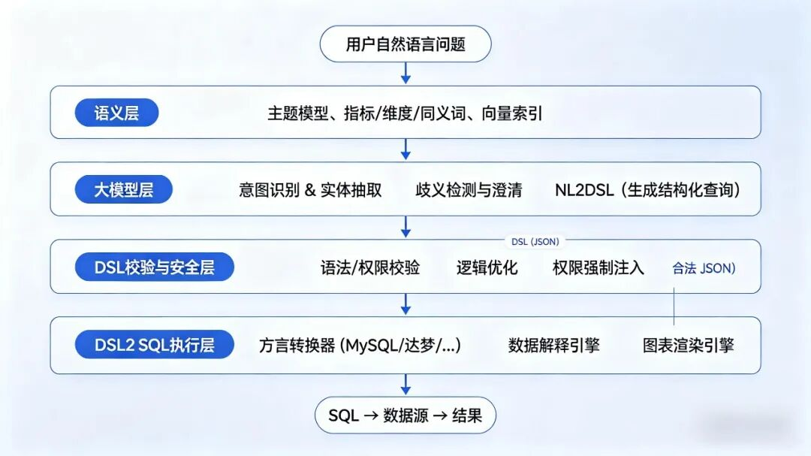

# 智能问数 SQL 生成引擎：从自然语言到可执行查询语句

在智能问数系统中，SQL 生成引擎是决定准确率和用户体验的核心模块。许多团队直接让大模型输出 SQL，结果在生产环境中准确率骤降至 50% 以下。原因在于：自然语言到 SQL 的转换缺少结构化的中间层。

本文介绍一套经过多企业实践检验的 SQL 生成引擎设计。核心思路是：通过语义层规范业务知识，通过大模型层生成结构化 DSL，通过执行层确定性翻译为 SQL。同时，针对落地中的常见难点（语义层维护、反馈闭环噪声等），给出务实的工程策略。

## 一、为什么不能直接让大模型写 SQL？

直接让大模型输出 SQL（即 Text2SQL）看似简单，但在生产环境中会遇到四个硬伤：

- **不可校验**：SQL 是字符串，很难用结构化规则验证其语义正确性（比如字段是否存在、聚合是否合理）。
- **不可优化**：无法在生成后对查询逻辑进行改写（如权限注入、过滤下推）。
- **不可适配**：不同数据库方言（MySQL vs 达梦 vs Oracle）需要不同的 SQL 语法，模型很难兼顾。
- **不可调试**：当 SQL 出错时，是模型理解有误？还是字段名用错了？很难定位。

因此，我们需要一个中间表示层——**DSL**（Domain Specific Language，领域特定语言），将"语义理解"与"语法生成"解耦。

## 二、引擎总体架构

## 三、语义层：业务知识的结构化底座

语义层是引擎的"知识底座"，它由数据工程师与业务人员共同维护。现实中的难点不是建一次，而是持续更新。因此我们采用以下策略：

- **自动化抽取**：从数据字典、元数据管理平台、已有 SQL 注释中自动抽取字段中文名、枚举值，减少人工录入。
- **人工补充**：对关键指标（如"销售额"）和易混淆维度（如"区域"）进行人工标注同义词、计算口径。
- **版本管理**：语义层配置存入 Git，支持 diff 和回滚。

**核心组件：**

- **主题模型**：按业务主题（销售、库存、财务）预定义事实表、维度表、常用指标。初期可以从一个宽表开始，逐步拆分。
- **指标/维度字典**：包含字段名、中文名、同义词、数据类型、计量单位、业务口径说明。例如 `sales_amount`：中文名"销售额"，同义词"营收|GMV"，单位"万元"，口径"不含退款"。
- **向量语义索引**：将字段注释、同义词、业务说明等向量化，用于检索增强。
- **业务知识库**：存放长文本业务规则、典型查询的 SQL/DSL 模板，供 Few-shot 示例检索。

> 实践建议：初期不必追求完整，优先覆盖高频查询涉及的字段（20% 字段支撑 80% 查询），后续迭代补充。

## 四、大模型层：从自然语言到结构化 DSL

DSL 是 JSON 格式的中间表示。下面是一个生产级 DSL 的完整示例，以及每个字段的含义。

### 4.1 DSL 字段说明

| 字段 | 类型 | 说明 |
|------|------|------|
| `version` | string | DSL 版本号，用于兼容性管理 |
| `query_type` | string | 查询类型：`select`（明细）、`aggregate`（聚合）、`compare`（对比）等 |
| `dataset` | object/string | 数据来源。可以是单表名，也可以是多表 JOIN 的复杂描述 |
| `dataset.type` | string | `join` 表示多表关联，省略则为单表 |
| `dataset.relation` | array | 参与查询的表列表，每个元素包含表名、别名、JOIN 类型和条件 |
| `select` | array | 输出的字段或表达式列表（支持简单字段、聚合函数、CASE WHEN、算术运算） |
| `filter` | object | WHERE 条件，支持嵌套 AND/OR 树 |
| `group_by` | array | 分组字段列表 |
| `order_by` | array | 排序规则，可指定空值位置（`nulls first/last`） |
| `limit` | integer | 最大返回行数 |

> **多表 JOIN 的表达**：通过 `dataset.relation` 数组可以描述任意多张表的 JOIN，只需在数组中依次列出每张表及其 JOIN 条件。例如 5 张表的关联，数组中就会有 5 个元素，DSL2SQL 转换器会按照数组顺序生成 JOIN 链。生产中对于超过 3 表的复杂 JOIN，建议通过语义层预定义为"逻辑宽表"或使用模板填充，避免大模型直接生成。

### 4.2 NL2DSL：DSL 是怎么生成的？

NL2DSL 的核心是 **RAG（检索增强生成）+ 大模型**，不微调模型。步骤如下：

1. **检索上下文**：根据用户问题，从语义层中检索相关字段、同义词、示例。
2. **构造 Prompt**：将检索到的内容填入精心设计的 Prompt 模板，模板明确要求输出 DSL。
3. **调用大模型**：大模型（如豆包、DeepSeek、GPT-4）根据 Prompt 输出 DSL。
4. **后处理与校验**：对模型输出的文本进行 JSON 解析，并用 DSL Schema 做语法校验。若失败则自动重试一次（更换检索示例或降低温度）。

### 4.3 歧义检测与澄清

在调用大模型之前，先对用户问题进行歧义检测。常见歧义类型：

- **指标歧义**："销售额"是指订单金额还是实收金额？
- **时间歧义**："本月"是自然月还是业务月？
- **维度歧义**："华北区"是指销售区域还是配送区域？

实现方式：将用户问题 + 语义层中可能冲突的字段描述，输入大模型让其判断是否有歧义，并给出澄清问题。检测到歧义后，Agent 反问用户，用户选择后继续生成。

## 五、DSL 校验与安全层

DSL 是结构化数据，可以精确校验和优化。

### 5.1 语法校验

- JSON Schema 验证
- 字段名属于该数据集的合法字段（与语义层比对）
- 操作符与字段类型匹配（如日期字段不能用 `like`）
- 聚合字段的字段类型为数值型

### 5.2 权限注入

- 根据用户角色，在 `filter` 条件中追加行级权限条件（如 `dept_id = current_user.dept_id`）
- 若用户原始查询中已包含同一字段的条件，采用叠加（AND）而非覆盖，防止绕过

### 5.3 逻辑优化

- 合并冗余过滤条件
- 移除永真条件（如 `1=1`）
- 限制 `limit` 最大值（如不超过 10000），防止超大查询

## 六、DSL2SQL 执行层：确定性翻译

DSL 到 SQL 的转换是确定性规则驱动，不依赖大模型，因此准确率 100%。每个数据库方言（MySQL、达梦、Oracle）有一个独立的转换器，核心逻辑是遍历 DSL 的 JSON 对象，逐段拼接 SQL 字符串。

| DSL 组件 | 转换后的 SQL 片段 |
|----------|------------------|
| `select` | `SELECT p.category, SUM(CASE WHEN ...) AS 销售额_2025, ...` |
| `dataset.relation` | `FROM sales_fact s INNER JOIN product_dim p ON ...`（支持任意多表 JOIN） |
| `filter` | `WHERE s.quarter IN (1) AND r.region_name IN ('华东','华南')` |
| `group_by` | `GROUP BY p.category` |
| `having` | `HAVING SUM(...) > 1000000` |
| `order_by` | `ORDER BY 增长率(%) DESC NULLS LAST` |
| `limit` | `LIMIT 10` |

**方言适配**：同一个 DSL 可以通过不同转换器生成 MySQL、达梦、Oracle 等不同语法的 SQL。例如 `limit` 在 MySQL 中翻译为 `LIMIT n`，在达梦中翻译为 `ROWNUM <= n`，上层业务无需改动。

## 七、反馈闭环：持续提升准确率

准确率提升依赖用户反馈的循环利用。

- **纠错入口**：用户可对查询结果点击"纠错"，提交正确 SQL 或 DSL。
- **审核机制**：纠错内容经过自动校验（SQL 可执行）和抽样人工审核后，加入 Few-shot 示例库和反馈修正库。
- **效果度量**：每月抽样评估 DSL 生成准确率（语义正确且可执行），作为优化依据。

经过持续迭代，生产环境准确率可从 50% 提升至 85%-90%（因业务复杂度而异），单表场景可达 95% 以上。

## 八、总结

本文介绍的 SQL 生成引擎采用 **语义层 + NL2DSL + DSL2SQL** 架构，核心优势：

- **可控性**：DSL 作为结构化中间表示，可校验、可优化、可调试。
- **准确率**：通过 RAG 增强、歧义检测、反馈闭环，生产环境准确率可达 85%-90%。
- **安全性**：在 DSL 层统一注入权限条件，杜绝 SQL 注入和越权查询。
- **可适配**：同一个 DSL 可翻译成不同数据库的 SQL 方言，无需修改上层逻辑。

如果你正在为智能问数的 SQL 生成准确率发愁，建议从单宽表 + 少量 Few-shot 示例起步，逐步引入语义层和 DSL，避免过度设计。
